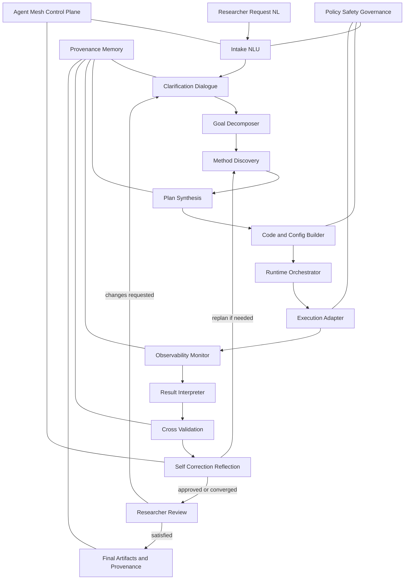

# TWAIN Domain-Neutral Agentic Simulation Pipeline

## 1. Purpose

Design a domain-neutral, self-discovering, self-correcting multi-agent pipeline that can:

1. Accept a research request in natural language.
2. Translate intent into executable simulation workflows.
3. Discover suitable public chemistry and scientific models/tools.
4. Generate code and runtime configuration.
5. Execute and monitor runs.
6. Interpret outputs and cross-validate against prior research.
7. Detect gaps, propose corrections, and rerun iteratively.
8. Keep the researcher in the middle for critical approvals.

This document is implementation-focused and maps directly to folder modules in this repository.

## 2. Quick Review Of Current Repository

Current repository content was minimal and contained:

- `TWAIN_Architecture.drawio` (rich layered architecture draft with many domain-specific elements)
- `Robert Wexler_1908.pdf`

Observation from existing architecture draft:

- Strong systems thinking and broad coverage already exists.
- Existing draft blends product clients (iOS/macOS/watchOS/visionOS), HPC orchestration, and chemistry/materials/physics-specific generation.
- For a domain-neutral agentic core, we should separate reusable intelligence modules from domain adapters.

The structure created in this task is centered on independent modules and explicit contracts.

## 3. Guiding Principles

1. Domain-neutral core, domain-specific adapters.
2. Contract-first agent communication with typed schemas.
3. Human approval gates for risk-sensitive decisions.
4. Every run is reproducible through provenance capture.
5. Self-correction loop is explicit, bounded, and auditable.
6. Tool/model discovery is evidence-based (capabilities + trust score).

## 4. Target Logical Architecture

## 5. Core Agent Modules

### 5.1 Intake NLU

- Converts natural language to structured intent.
- Identifies objectives, constraints, confidence, and ambiguity spans.
- Emits: `IntentSpec`.

### 5.2 Clarification Dialogue

- Asks targeted follow-up questions when confidence/constraints are insufficient.
- Applies stop condition: "minimum executable intent quality".
- Emits: `RefinedIntentSpec`.

### 5.3 Goal Decomposer

- Breaks request into sub-goals: model choice, data prep, compute plan, validation strategy.
- Emits: `GoalGraph`.

### 5.4 Method Discovery

- Discovers public tools/models/workflows from trusted registries and local catalog.
- Scores candidates by relevance, maturity, license, and reproducibility evidence.
- Emits: `CandidateMethodSet`.

### 5.5 Plan Synthesis

- Selects toolchain and composes executable workflow graph.
- Defines expected outputs and acceptance criteria.
- Emits: `ExecutionPlan`.

### 5.6 Code and Configuration Builder

- Generates scripts, configs, container specs, and run manifests.
- Adds unit checks and smoke tests when possible.
- Emits: `RunBundle`.

### 5.7 Runtime Orchestrator

- Schedules and coordinates execution lifecycle.
- Supports local, cluster, and cloud backends through adapters.
- Emits: `RunSession` updates.

### 5.8 Execution Adapter

- Backend abstraction layer (local shell, Slurm, PBS, Kubernetes, cloud batch).
- Standardizes command submission and status polling.
- Emits: `ExecutionEvents`.

### 5.9 Observability Monitor

- Captures logs, metrics, traces, and quality signals.
- Detects early failure patterns and resource anomalies.
- Emits: `RunDiagnostics`.

### 5.10 Result Interpreter

- Parses outputs into structured findings with uncertainty metadata.
- Produces researcher-facing summaries plus machine-readable metrics.
- Emits: `ResultPackage`.

### 5.11 Cross Validation

- Compares outcomes against:
  - prior internal runs,
  - known literature references,
  - baseline methods.
- Emits: `ValidationReport` with gap analysis.

### 5.12 Self Correction Reflection

- Diagnoses root causes when acceptance criteria are not met.
- Proposes targeted modifications (inputs, model, parameters, solver, resources).
- Triggers bounded rerun loop with rationale.
- Emits: `CorrectionPlan`.

### 5.13 Human In The Loop

- Mandatory approval checkpoints:
  - plan approval,
  - major cost/risk change,
  - final acceptance.
- Supports researcher edits and instruction overrides.

### 5.14 Provenance Memory

- Stores prompts, plans, code versions, environment hashes, outputs, and decisions.
- Enables reproducibility and auditability.

### 5.15 Policy Safety Governance

- Enforces policy constraints, licensing checks, model/tool allow-lists, and data handling rules.
- Blocks unsafe/unapproved actions.

### 5.16 Agent Mesh Control Plane

- Handles routing, retries, timeouts, budgets, and state transitions across agents.
- Provides observability and circuit-breakers for agent loops.

## 6. Data Contracts (First Pass)

- `IntentSpec`: objective, domain hints, material/system descriptors, constraints, acceptance metrics.
- `GoalGraph`: DAG of sub-goals with dependencies.
- `CandidateMethodSet`: ranked candidates with evidence and licensing.
- `ExecutionPlan`: selected pipeline, compute estimate, risk notes.
- `RunBundle`: generated source/config/container metadata.
- `RunDiagnostics`: runtime signals and failures.
- `ResultPackage`: normalized outputs and KPIs.
- `ValidationReport`: agreement/disagreement versus baseline and prior runs.
- `CorrectionPlan`: proposed deltas and expected gain.

All contracts should be JSON Schema in `schemas/` and versioned.

## 7. Self-Discovery Pattern

1. Query internal capability catalog.
2. Query external trusted registries.
3. Normalize metadata to a common capability model.
4. Score candidates with weighted rubric.
5. Keep top-k with explainable ranking.
6. Ask researcher approval if confidence is below threshold.

## 8. Self-Correction Pattern

Use iterative bounded optimization:

$$
\text{best\_run}_{t+1} = \arg\max_{c \in C_t} \left[\alpha \cdot Q(c) - \beta \cdot Cost(c) - \gamma \cdot Risk(c)\right]
$$

Where:

- $Q(c)$ is quality improvement forecast.
- $Cost(c)$ is estimated compute/time budget.
- $Risk(c)$ includes policy, reproducibility, and instability penalties.

Stop when one is true:

1. Researcher accepts result.
2. Acceptance criteria met.
3. Max iteration or budget reached.
4. Confidence gain plateaus.

## 9. Folder Mapping In This Repository

- `modules/01_intake_nlu`
- `modules/02_clarification_dialogue`
- `modules/03_goal_decomposer`
- `modules/04_method_discovery`
- `modules/05_plan_synthesis`
- `modules/06_code_configuration_builder`
- `modules/07_runtime_orchestrator`
- `modules/08_execution_adapter`
- `modules/09_observability_monitor`
- `modules/10_result_interpreter`
- `modules/11_cross_validation`
- `modules/12_self_correction_reflection`
- `modules/13_human_in_the_loop`
- `modules/14_provenance_memory`
- `modules/15_policy_safety_governance`
- `modules/16_agent_mesh_control_plane`

Supporting folders:

- `interfaces/` for typed inter-module APIs.
- `schemas/` for contract schemas.
- `configs/` for environment and policy config.
- `tests/` for unit, integration, and replay tests.
- `experiments/` for sandboxes and benchmark notebooks/scripts.
- `scripts/` for developer automation.
- `docs/backlog/` for delivery backlog.
- `docs/decisions/` for architecture decision records.

## 10. Non-Functional Requirements

1. Reproducibility: rerun any historical pipeline from provenance record.
2. Explainability: each decision includes ranked alternatives and rationale.
3. Safety: policy checks pre-execution and pre-publication.
4. Extensibility: add a new domain adapter without changing core modules.
5. Reliability: retry strategies with bounded exponential backoff.
6. Cost control: per-run and per-project budget guardrails.

## 11. Recommended Next Build Sequence

1. Define schemas for `IntentSpec`, `ExecutionPlan`, `ValidationReport`, `CorrectionPlan`.
2. Implement control plane state machine and module interface stubs.
3. Implement Intake + Clarification + Plan Synthesis MVP.
4. Add one execution backend (local) and one validation baseline.
5. Add self-correction loop with capped iterations.
6. Add researcher approval UI/CLI checkpoints.

## 12. Open Decisions

1. Primary orchestrator framework (custom graph runner vs agent framework).
2. Preferred LLM/model providers and fallback hierarchy.
3. Canonical provenance storage technology.
4. Target first chemistry model family for MVP validation.
5. Trust policy for external tool discovery sources.
