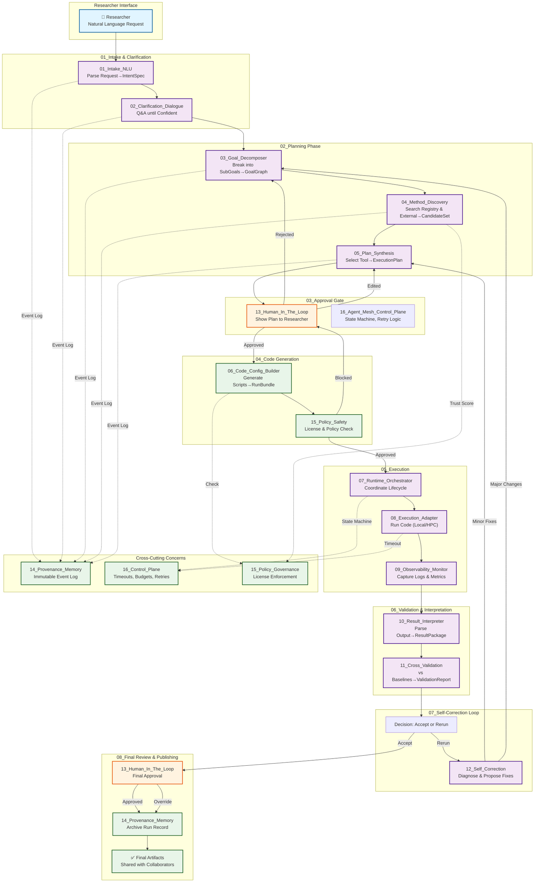
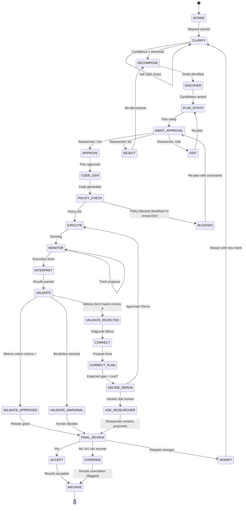
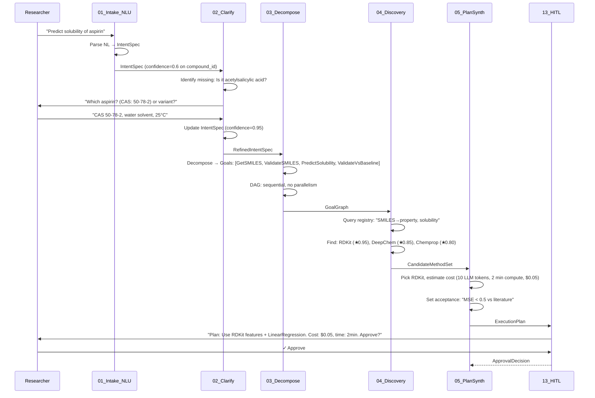
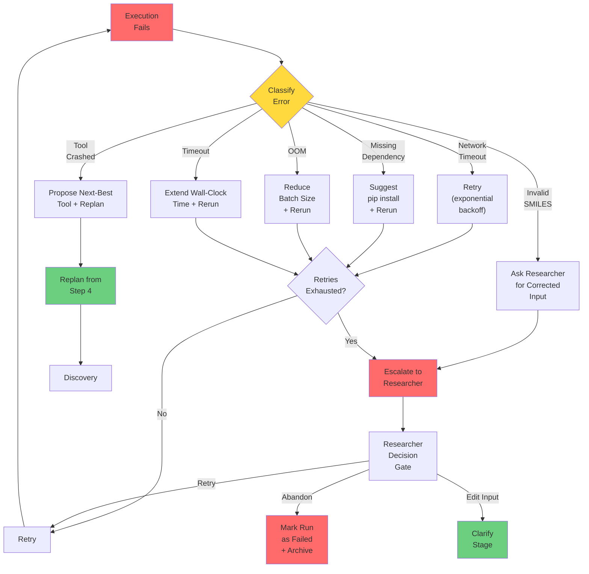

# TWAIN Pipeline Flow & Module Interaction Diagram

## Complete System Dataflow



---

## Module Interaction Matrix

| → | 01 | 02 | 03 | 04 | 05 | 06 | 07 | 08 | 09 | 10 | 11 | 12 | 13 | 14 | 15 | 16 |
|---|----|----|----|----|----|----|----|----|----|----|----|----|----|----|----|----|
| **01_Intake** | — | ✓ | ✓ | — | — | — | — | — | — | — | — | — | ✓ | ✓ | — | ✓ |
| **02_Clarify** | — | — | ✓ | — | — | — | — | — | — | — | — | — | ✓ | ✓ | — | ✓ |
| **03_Decompose** | — | — | — | ✓ | — | — | — | — | — | — | — | — | — | ✓ | — | ✓ |
| **04_Discovery** | — | — | — | — | ✓ | — | — | — | — | — | — | — | — | ✓ | ✓ | ✓ |
| **05_PlanSynth** | — | — | — | — | — | — | — | — | — | — | — | — | ✓ | ✓ | ✓ | ✓ |
| **06_CodeGen** | — | — | — | — | — | — | ✓ | — | — | — | — | — | — | ✓ | ✓ | — |
| **07_Orchestrate** | — | — | — | — | — | — | — | ✓ | ✓ | ✓ | ✓ | ✓ | — | ✓ | — | ✓ |
| **08_ExecAdapter** | — | — | — | — | — | — | — | — | ✓ | — | — | — | — | ✓ | — | ✓ |
| **09_Monitor** | — | — | — | — | — | — | — | — | — | ✓ | — | — | — | ✓ | — | ✓ |
| **10_Interpret** | — | — | — | — | — | — | — | — | — | — | ✓ | ✓ | — | ✓ | — | — |
| **11_CrossVal** | — | — | — | — | — | — | — | — | — | — | — | ✓ | — | ✓ | — | ✓ |
| **12_Correct** | — | — | ✓ | ✓ | ✓ | — | — | — | — | — | — | — | ✓ | ✓ | — | ✓ |
| **13_HITL** | — | — | — | — | — | — | — | — | — | — | — | — | — | ✓ | — | ✓ |
| **14_Provenance** | — | — | — | — | — | — | — | — | — | — | — | — | — | — | — | — |
| **15_Policy** | — | — | — | ✓ | ✓ | ✓ | — | — | — | — | — | — | — | — | — | ✓ |
| **16_ControlPlane** | — | — | — | — | — | — | — | — | — | — | — | — | — | — | — | — |

Legend: ✓ = direct interaction; — = no direct interaction

---

## State Machine: Major Transitions



---

## Data Flow: Contract Sequence



---

## Error Recovery Paths



---

## Module Dependencies (Build Order)

```mermaid
graph LR
    EP1["Epic 1<br/>Schemas"]
    EP2["Epic 2<br/>Control Plane"]
    EP3["Epic 3<br/>Researcher UX"]
    EP4["Epic 4<br/>Discovery"]
    EP5["Epic 5<br/>Code Gen"]
    EP6["Epic 6<br/>Validation"]
    EP7["Epic 7<br/>Provenance"]
    EP8["Epic 8<br/>Chemistry Pilot"]
    
    EP1 --> EP2
    EP1 --> EP3
    EP1 --> EP4
    EP1 --> EP5
    EP1 --> EP6
    EP1 --> EP7
    
    EP2 --> EP5
    EP2 --> EP7
    
    EP3 --> EP5
    
    EP4 --> EP5
    
    EP5 --> EP6
    EP5 --> EP7
    
    EP6 --> EP7
    
    EP2 --> EP8
    EP3 --> EP8
    EP4 --> EP8
    EP5 --> EP8
    EP6 --> EP8
    EP7 --> EP8
    
    style EP1 fill:#ff9999,stroke:#c00
    style EP2 fill:#ff9999,stroke:#c00
    style EP8 fill:#99ccff,stroke:#00c
    
    classDef normal fill:#ffcc99,stroke:#f60
    class EP3,EP4,EP5,EP6,EP7
```

---

## Runtime Execution Timeline (Example: 1 Iteration)

```
Researcher: "Predict aspirin solubility"
│
├─ [00:00] 01_Intake_NLU (10s)
│          Parses: "aspirin", "solubility", infers aqueous
│
├─ [00:10] 02_Clarification (30s)
│          Q: "CAS 50-78-2?" → R: "Yes"
│
├─ [00:40] 03_Goal_Decomposer (5s)
│          GoalGraph: [getSmiles → validateSmiles → predict → validate]
│
├─ [00:45] 04_Method_Discovery (20s)
│          Query registry + PyPI, rank 3 candidates
│
├─ [01:05] 05_Plan_Synthesis (10s)
│          Select RDKit, estimate cost $0.05, time 2min
│
├─ [01:15] HUMAN APPROVAL (⏸ awaiting researcher)
│          Researcher sees plan, clicks "Approve"
│
├─ [05:15] 06_Code_Gen (5s)
│          Generate main.py + requirements.txt
│
├─ [05:20] 15_Policy_Check (2s)
│          License = MIT ✓, Cost OK ✓
│
├─ [05:22] 07_Runtime_Orchestrator (2s)
│          Create session, checkpoint state
│
├─ [05:24] 08_Execution_Adapter (130s)
│          Install deps (90s), run main.py (40s), capture output
│
│          [Execution events streamed to 09_Monitor]
│          ├─ 05:24 - pip install rdkit (90s)
│          ├─ 06:54 - Execute prediction script
│          ├─ 07:34 - Output written to solubility.csv
│          └─ 07:35 - Execution complete, exit code 0
│
├─ [07:35] 10_Result_Interpreter (3s)
│          Parse CSV: predicted_solubility=2.3 (log units), std_dev=0.15
│
├─ [07:38] 11_Cross_Validation (2s)
│          vs literature baseline: literature=2.1, error=0.2
│          VALIDATION: ACCEPTED (within MSE < 0.5 threshold)
│
├─ [07:40] 12_Self_Correction (skip)
│          Validation passed, no correction needed
│
├─ [07:41] FINAL REVIEW (⏸ awaiting researcher)
│          Show: Predicted=2.3, Literature=2.1, Error=0.2
│          Researcher: "Looks good!"
│
├─ [07:45] 14_Provenance_Memory (2s)
│          Archive session event log + artifacts
│
└─ [07:47] ✅ DONE
          Publish: Code, config, results, provenance JSON
          Researcher: "Share with collaborators" → GCS URL

Total: 7 min 47 sec (vs estimate 5 min — overhead from deps + safety checks)
```

---

## Resource Utilization Profile

```
CPU:      ███░░░░░░░░░░░░░░░░ (15% avg, 40% peak during execution)
Memory:   ██░░░░░░░░░░░░░░░░░ (2% avg, 8% peak during execution)
Network:  █░░░░░░░░░░░░░░░░░░ (1% avg, used for PyPI/GitHub discovery)
Disk:     █░░░░░░░░░░░░░░░░░░ (artifacts cache, logs)

Bottlenecks:
  - Dependency installation (pip): 60–90s (first run), cached thereafter
  - Execution (tool-dependent): 10s–10min (e.g., MD simulations >> property prediction)
  - LLM latency (planning, clarification): 2–10s per call
  - Cross-validation (baseline lookup + metric computation): <5s
```

---

## Contract Validation Checkpoints

Every inter-module handoff validates contracts:

```
┌──────────────────────────┐
│ IntentSpec              │
│ {objective, domain,     │
│  system_descriptors,    │
│  constraints,           │
│  acceptance_metrics}    │
└──────────────────────────┘
         ↓
    [Validate]
         ↓
┌──────────────────────────┐
│ RefinedIntentSpec       │
│ (same schema, higher    │
│  confidence scores)     │
└──────────────────────────┘
         ↓ → 03_Decompose
    [Validate]
         ↓
┌──────────────────────────┐
│ GoalGraph               │
│ {goals[], edges[],      │
│  metadata}              │
└──────────────────────────┘
         ↓ → 04_Discovery
    [Validate]
         ↓
┌──────────────────────────┐
│ CandidateMethodSet      │
│ [{method, score,        │
│   trust_tier}]          │
└──────────────────────────┘
         ↓ → 05_PlanSynth
    [Validate]
         ↓
┌──────────────────────────┐
│ ExecutionPlan           │
│ {selected_method,       │
│  compute_estimate,      │
│  acceptance_criteria}   │
└──────────────────────────┘
         ↓ → 06_CodeGen + 13_HITL
    [Validate]
         ↓
┌──────────────────────────┐
│ RunBundle               │
│ {main.py, config.yaml, │
│  requirements.txt}      │
└──────────────────────────┘
         ↓ → 08_Executor
    [Execute & Capture]
         ↓
┌──────────────────────────┐
│ ExecutionResult         │
│ {exit_code, stdout,     │
│  stderr, artifacts}     │
└──────────────────────────┘
         ↓ → 10_Interpreter
    [Parse & Normalize]
         ↓
┌──────────────────────────┐
│ ResultPackage           │
│ {primary_metric,        │
│  secondary_metrics,     │
│  quality_flags}         │
└──────────────────────────┘
         ↓ → 11_CrossValidate
    [Validate]
         ↓
┌──────────────────────────┐
│ ValidationReport        │
│ {baseline_comparison,   │
│  acceptance_status,     │
│  diagnoses}             │
└──────────────────────────┘
         ↓ → 12_Correct (if needed) or 13_HITL (final review)
```

---

## Summary

- **Total Modules**: 16 independent agents
- **Critical Path**: Epics 1, 2, 4, 5, 6 (must complete in order)
- **Parallel Work**: Epics 3, 7 can proceed independently once Epic 1 is done
- **Convergence**: Epic 8 validates all modules integrated correctly
- **Reproducibility**: Full provenance enables deterministic replay from any historical state
